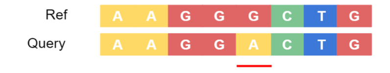
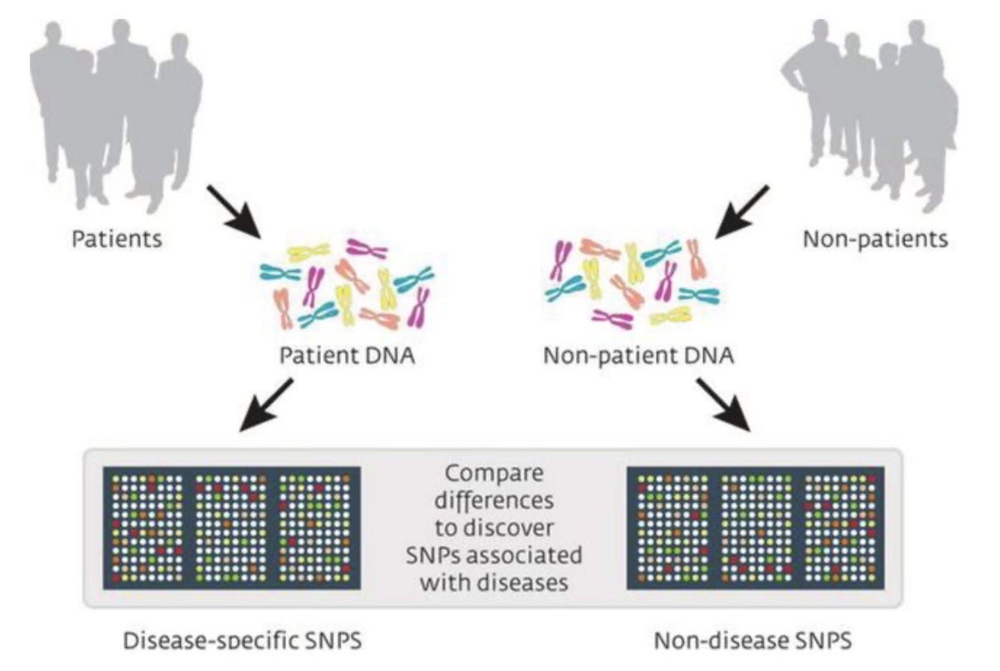

# 🧬 What is Genomic Variant Analysis (GVA) ?

Genomic variant analysis is a method for studying variations in the DNA sequences of an organism's genome. Genomic variant analyses can be performed on many different organisms but are most commonly done in humans, where the goal is to identify differences between a given person’s genome and a standardized human reference genome. These differences are known as genomic variants.

Genomic variants can include single nucleotide polymorphisms (SNPs), insertions and deletions (indels), and structural variations. SNPs are the most common form of genomic variation, involving the substitution of a single nucleotide at a specific position in a DNA sequence, and they partially explain differences in traits such as eye color or susceptibility to specific diseases.

Insertions and deletions, on the other hand, involve the addition or removal of nucleotides in the genome and can lead to frameshift mutations. Indels are of great interest when performing genomic variant analyses because they are known to cause many diseases, such as cystic fibrosis, which occurs when an indel polymorphism within the CFTR gene eliminates a single amino acid.

Finally, structural variations are the least common form of genomic variation. Although rare, structural variations cause large-scale alterations in the genome, such as duplications, inversions, or translocations, disrupting protein-coding genes and genomic regulatory elements and impacting extensive DNA segments.

# 🧬 Why Perform Genomic Variant Analysis (GVA) ?

Modern bioinformatics analyses, such as GVA, are reshaping the biomedical field by accelerating genomic research, enabling personalized medicine, and uncovering novel biological mechanisms at an unprecedented scale. By performing genomic variant analysis on a large scale, we can better understand genetic diversity within and between populations, uncover insights into evolutionary processes, and identify associations between specific mutations and disease states. For example, researchers may investigate the link between a particular SNP and cancer susceptibility or responsiveness to a given drug treatment. It’s even possible to use GVA to identify associations between certain SNPs and properties of animal tissue, which could be used in cultured meat production — for example, selecting for mutations associated with specific tastes, textures, or health properties.

Additionally, many companies leverage genomic variation analysis to offer diverse services, from ancestry insights to personalized medical recommendations. For example, genetic testing companies such as Nebula Genomics use genomic variation analysis to provide customers with insights into their ancestry, traits, and potential health risks based on genomic variations. Pharmaceutical companies, on the other hand, may use genomic variant analysis in their drug development process to identify potential drug targets, understand patient responses, and develop personalized therapies.

There are even companies such as Variant Bio that are leveraging the power of DNA and RNA sequencing data to study genes in people who are outliers for medically relevant traits, such as the Sherpa people living at high altitudes in Nepal who have gene variants that allow them to lead healthy, active, lives with blood oxygen levels far below what most humans need to function. By studying genetic variants associated with medically desirable traits, like those possessed by the Sherpa people, Variant Bio can identify novel drug targets and develop therapies that could pass some of these benefits on to the rest of us.

# 🧬 What Type of Data Is Needed For Genomic Variant Analysis? How Is It Collected?

As previously mentioned, genomic variant analysis, involves the comprehensive study of genetic variations within a population, or between individuals in a population. Three key datasets play crucial roles in this type of analysis: the reference genome, variant data, and phenotypic data.

The reference genome serves as the baseline genetic blueprint for the organism under investigation, providing a standard against which genetic variations are compared. Collecting reference genome data involves using high-throughput sequencing technologies, such as next-generation sequencing (NGS), to sequence the DNA of a small number of individuals from a population, producing a vast amount of short reads. Next, computational tools are used to assemble the short reads into longer continuous sequences, creating a representation of the organism's genome. Finally, the assembled genome is annotated to identify genes, regulatory elements, and other features. This results in a complete reference genome for a given species.

Whereas the reference genome acts as a standard blueprint for an entire species, variant data represents differences between individual genomes and the reference, encompassing information about genetic differences, such as single nucleotide polymorphisms (SNPs) or insertions/deletions (indels) for a given individual. Variant data can be obtained from various sources, including public databases, such as the 1000 Genomes Project, dbSNP, and the Broad Institutes Genome Aggregation Database (gnomAD). Researchers and bioinformaticians often access these repositories to acquire high-quality variant data for their analyses. Variant data typically take the form of variant call files (VCF), which store information about genetic variations observed in sequenced samples.

Finally, phenotypic data captures an individual's observable traits or characteristics, connecting genetic variations to potential phenotypic outcomes. The collection of phenotypic data varies based on the nature of the study, the traits under investigation, and the specific goals of the research. Common methods for collecting phenotypic data include medical records containing clinical data from patient records, surveys where people provide self-reported information about lifestyle, family history, and other factors, laboratory measurements containing information on biochemical markers, metabolic profiles, and blood cell counts, and behavioral data. Data from wearable health trackers, such as the NNOXX wearable, may even be used for this type of analysis someday.

The integration of reference genome, variant, and phenotypic data enables researchers to unravel the genetic basis of traits, diseases, and other phenotypic characteristics, fostering a deeper understanding of genomic variations and their implications. The next section will explore what to do with this data.

# 🧬 How Do We Analyze Large-Scale Genomic and Phenotypic Data?

Advances in sequencing technologies are continually making it easier to create reference genomes, collect an individual's genomic data to identify common and rare variants, and spot population-specific genetic differences and potential disease associations. This addresses the issue of data collection. Now, the question is what we do with this data to derive actional insights.

After collecting sufficient data, advanced computational tools and algorithms are crucial for analyzing large-scale genomic data, interpreting variations, and correlating them with biological functions. There are four generally accepted steps to this process, including variant calling, annotating variants, filtering data, and association testing.

Variant calling is a crucial step in genomic variant analysis where sequenced reads identified from high-throughput sequencing data are compared to a reference genome, allowing researchers to pinpoint differences in DNA sequences between the individual being studied and a reference genome. Additionally, variant calling can be used in a clinical setting for diagnosing genetic disorders, predicting disease risk, and personalizing treatment strategies. For example, a clinician may screen an underweight patient with repeated lung infections and identify an indel in the CFTR gene, helping them diagnose the patient with cystic fibrosis. 


(image source https://www.melbournebioinformatics.org.au/tutorials/tutorials/longread_sv_calling/longread_sv_calling/)

Annotating variants involves adding additional information to the variant data, such as allele frequencies, information about the genes affected by variants, predicted functional consequences, disease associations, and other annotations from various databases. This additional information helps researchers and bioinformaticians understand the potential impact and relevance of identified genetic variants.

After calling and annotating variants, the data is filtered based on the quality and depth, which is necessary for obtaining a reliable set of variants for downstream analysis. Quality refers to confidence in the accuracy of data. In contrast, depth refers to the number of sequencing reads aligning to a specific genome position. Filtering by quality helps remove variant calls with lower confidence (which may result from sequencing errors), reducing the likelihood of false positives, and filtering by depth ensures that an adequate number of reads supports a variant. The specific filtering criteria and scoring used to assess quality and depth can vary based on the experimental design, sequencing platform, and the desired balance between sensitivity and specificity. Still, the filtering process generally helps researchers focus on high-confidence variants that are more likely to be biologically meaningful, improving the accuracy of association studies, functional annotation, and other genomic analyses. 



Finally, association testing is used to identify associations between genetic variants and phenotypic traits to determine whether specific genetic variants are significantly associated with a particular trait or disease, as demonstrated in the image above.

# 🧬 A DIY Guide To Genomic Variant Analysis (GVA)

So far, we’ve covered what genomic variant analysis is, what type of data is required to conduct it, how that data is collected, and the broad strokes of how to perform this type of analysis. In this section, I will provide an end-to-end DIY guide to genomic variant analysis, showing you how to perform the four steps: variant calling, annotating variants, filtering data, and association testing.

When creating this guide, I had to make a series of assumptions, including the names of files used to store certain data sets, the format of said files, and even their sources. As a result, it’s unlikely that you’ll be able to use the code in the following sections as written and perform a bespoke analysis. Because of these logistical hurdles, I’ve written the following guide with a layer of abstraction built in. The specifics of the code in each step are less important than understanding what the code is meant to do, what the goals of each step are, and how they fit within the context of a genomic variant analysis. If you understand these principles, you can modify the code below to suit your specific needs or write new code from scratch, knowing your objectives in each step.

**Step 1: Variant Calling**

As previously mentioned, variant calling is a crucial step in genomic variant analysis where sequenced reads identified from high-throughput sequencing are compared to a reference genome, allowing researchers to pinpoint differences in DNA sequences between the individual being studied and a reference genome. 

Recording reference genome data involves using next-generation sequencing (NGS) to sequence the DNA of a small number of individuals from a population and then using computational tools to create a representative genome for that species. The assembled genome is then annotated to identify genes, regulatory elements, and other features, resulting in a complete reference genome. Thankfully, we do not need to create a reference genome from scratch to perform variant analyses on commonly studied species. Instead, we can download reference genomes from databases such as GENCODE in FASTA file formats. For example, you can download GRCh38, which is the most up-to-date reference genome for the human species, here. 

However, to perform variant calling, we also need individuals' raw genome data, which can be obtained through various methods, such as NGS and microarray analysis. These types of sequencing methods generally provide output data in BAM files with aligned reads.

Now, I'll show you how to perform variant calling using the Unix programming language in the sample code below. These steps assume you've already downloaded a reference genome in a FASTA format using Unix's wget command and that you have an aligned reads BAM file containing an individual's sequencing data. 

```
samtools sort -o sorted_reads.bam aligned_reads.bam
```
The code above uses Unix’s samtools sort command to sort the aligned sequencing reads generated from NGS or microarray analysis. After calling the samtools sort command, the code specifies -o sorted_reads.bam as the name of the output file and aligned_reads.bam as the name of the input file. When executed, this code will sort the contents in the input file and store the newly sorted data with the new output file name. Importantly, you should replace the file name aligned_reads.bam with the actual name of the BAM file storing your aligned reads data. 

```
samtools index sorted_reads.bam
```
Whereas the previous code block used the samtools sort command, the code block directly above uses the samtools index command to index the content of the output file named sorted_reads.bam, allowing for the fast and efficient lookup of the data contained within.
```
samtools mpileup -uf reference_genome.fa sorted_reads.bam > output.pileup
```
This next block of code uses samtools mpileup command to generate a pileup file containing information about the reads at each genomic position. The inputs for the pileup file are the reference genome (reference_genome.fa), and the sorted reads file (sorted_reads.bam) generated in the previous steps. The code then redirects the pileup information to a new output file using the following command: > output.pileup. 
```
bcftools call -mv -Ov -o variants.vcf output.pileup
```
After generating a pileup file, the bcftools call command calls variants from the pileup file (output.pileup), which contains information about the alignment of short nucleotide sequences to the chosen reference genome. The resulting VCF file includes information on the genomic positions, reference alleles, alternative alleles, and variant quality, among other details, for the identified variants. Then, the flags -mv and -Ov specify the variation calling options and the output file format (in this case, VCF), respectively. Following that, the code -o variants.vcf output.pileup specifies the names of the output and input file respectively. 

Importantly, many databases provide you with variant call format (VCF) files, potentially making the above steps redundant or unnecessary — particularly if you wish to perform a genomic variant analysis with existing data instead of using newly acquired data for bespoke analysis. Databases where you can obtain VCF files include the 1000 Genomes Project, dbSNP, and the Broad Institutes Genome Aggregation Database (gnomAD). 

**Step 2: Annotate Variants**

After performing variant calling, the next step in GVA analysis is to annotate variants, which involves adding additional information to the variant data, such as information about the genes affected by variants, predicted functional consequences, disease associations, and other information stored in various databases. In the sample code block below, I’ll demonstrate how to annotate variants after you obtain a variant call format (VCF) file:

```
table_annovar.pl variants.vcf humandb/ -buildver hg38 -out annotated_variants -remove -protocol refGene -operation g
```
The code block above begins with table_annovar.pl, which uses the ANNOVAR Perl command for annotating genetic variants. Next, the code specifies the input file containing variant information (variants.vcf), the directory containing ANNOVAR's annotation databases for the human genome (humandb/), which include information on genes, transcripts, and other genomic features, the genome build version (-buildver hg38, which refers to human genome build version 38), and the prefix for the output files (-out annotated_variants). Then, the -remove command is used to remove intermediate files generated during the annotation process, and -protocol refGene specifies the annotation protocol to use (in this case, it uses the refGene database, which contains information about RefSeq genes). Finally, -operation g specifies the operation to perform (the "g" stands for gene-based annotation). 

**Step 3: Filter Data**

After calling and annotating variants, the next step in the genomic variant analysis is to filter data based on its quality and depth, which is necessary for obtaining a reliable set of variants for downstream analysis. In the sample code block below, I’ll demonstrate how to filter data stored in a VCF file using Unix’s bcftools and how to convert the filtered VCF to a tabular format using bcftools query:
```
bcftools filter -i 'QUAL > 20' && DP > 10' variants.vcf > filtered_variants.vcf
```
The code block above begins with Unix'sUnix's bcftools filter command, which invokes the filtering functionality of bcftools. Then, the code -i ''QUAL > 20 && DP > 10'' specifies the filter conditions. In this case, variants with a quality (QUAL) score greater than twenty and a read depth (DP) greater than ten are retained — all other variants are removed. The code then specifies the names of the input file containing variant data (variants.vcf) and then the command > filtered_variants.vcf redirects the filtered output to a new VCF file (filtered_variants.vcf)
```
bcftools query -f '%CHROM\t%POS\t%REF\t%ALT\n' filtered_variants.vcf > variants_table.txt
```
After generating a new filtered output file with the previous code block, the code directly above uses bcftools query command to convert the newly acquired VCF file (filtered_variants.vcf) to a tabular format. The resulting table (variants_table.txt) will contain information about the chromosome, position, reference allele, and alternate allele for each variant, which is specified with the following code: -f '%CHROM\t%POS\t%REF\t%ALT\n'. 

**Step 4: Association Testing**

The final step of genomic variant analysis is to perform association testing, which identifies associations between genetic variants and phenotypic traits to determine whether specific genetic variants are significantly associated with a particular trait or disease. Whereas the previous steps in your GVA used Unix/bash, the following code blocks will use Python, my preferred programming language and the one I’m most comfortable programming in. Technically, I could have also written the code for the previous steps in Python. However, Python is less efficient and less commonly used for those tasks (I also wanted to challenge myself to write this guide with Unix, which I have less experience with).
```
import pandas as pd
from scipy.stats import chi2_contingency
```
To perform association testing, we first need to import pandas, a commonly used data manipulation library based on the R programming language, and the chi2_contingency function from the scipy.stats library. 
```
variants = pd.read_csv('variants_table.txt', sep='\t', header=None, names=['CHROM', 'POS', 'REF', 'ALT'])
phenotypes = pd.read_csv('phenotypes.csv')
merged_data = pd.merge(variants, phenotypes, on='SampleID')
```
Next, we use Panda's CSV reading function (pd.read_csv) to read the data from our text file named variants_table.txt, which contains information about the chromosome, position, reference allele, and alternate allele for each variant. Importantly, we include the code sep='\t' since txt files use a tab-separated value format. In contrast, true CSV files are comma-separated (making this unnecessary). Additionally, we specify that there is no header row in our text file with the code header=Noneand the names for each column in our data frame with the code names=['CHROM', 'POS', 'REF', 'ALT']. 

The next line of code then uses Panda's CSV reading function to import a CSV file containing phenotypic data, and the following line merges the two data frames (variants and phenotypes) based on a common column ('SampleID' in this case).
```
contingency_table = pd.crosstab(merged_data['ALT'], merged_data['Phenotype'])
```
This next line of code uses Panda’s cross tab function (pd.crosstab)create a contingency table showing the counts of different variant alleles for each phenotypic variable.
```
chi2, p = chi2_contingency(contingency_table)
print(f'Chi-square: {chi2}, p-value: {p}')
```
Finally, the code above uses the chi2_contingency function we imported from the scipy.stats library, which is used to perform a chi-square test of independence on our contingent table (contingency_table) showing the frequency distribution of phenotypes for each allele variant. Additionally, it’s worth noting that the code chi2, p unpacks the result of the chi-square test into two variables: chi2 is the test statistic from the chi-square test, and p is the p-value used to determine the probability of observing a chi-square statistic as extreme as, or more extreme than, the one computed from the sample data. If the p-value is below a chosen significance level (commonly 0.05), you may reject the null hypothesis of independence, meaning that the observed result of the association test is both meaningful and statistically significant. 
